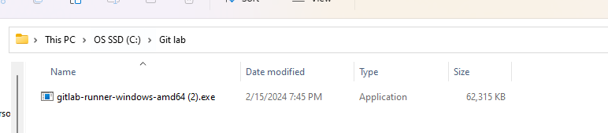
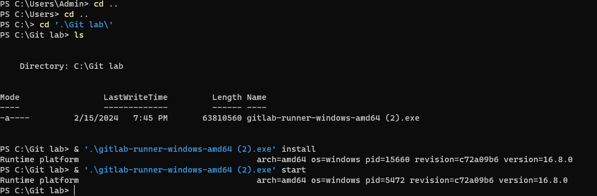
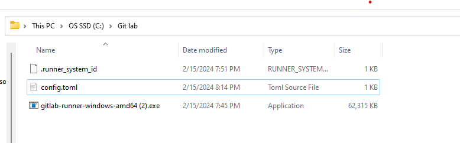
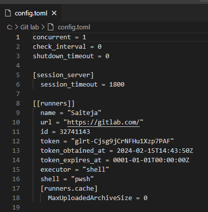
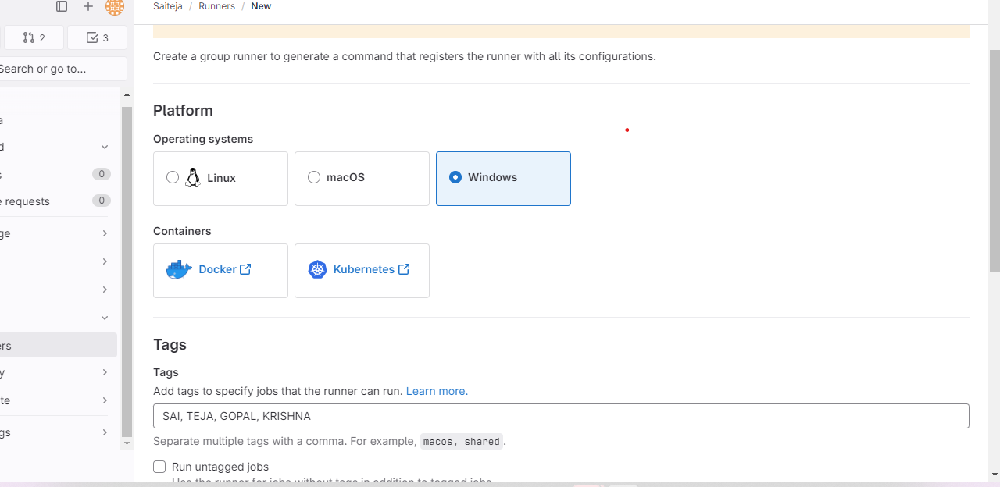
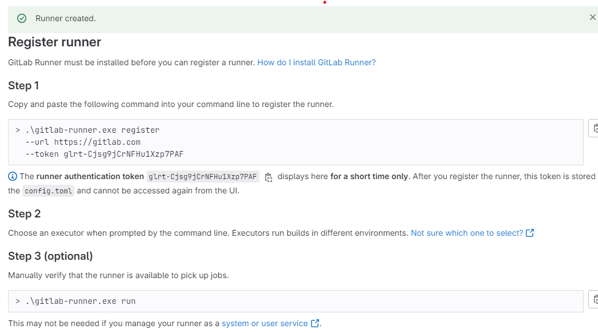
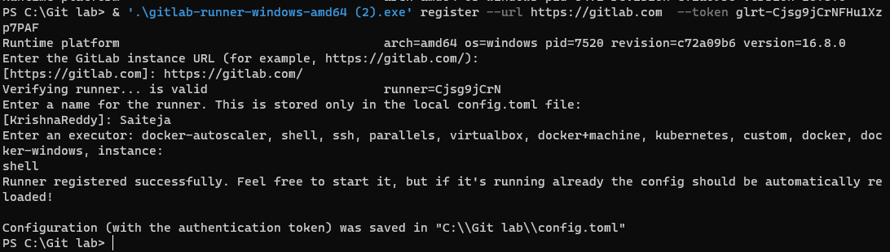
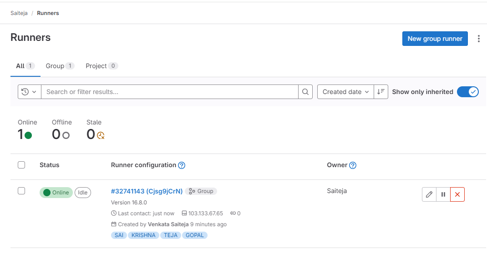
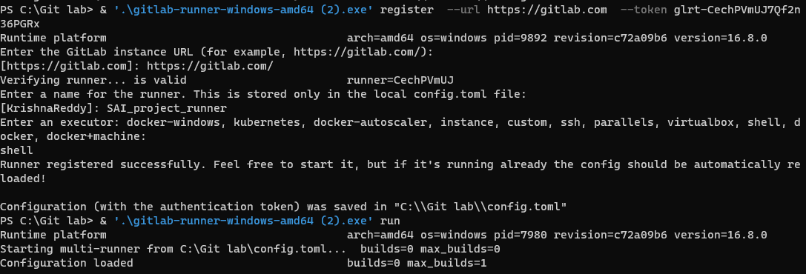
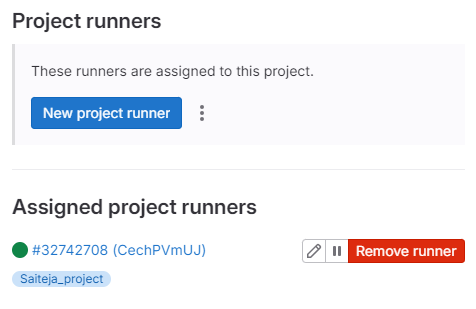

## INSTALLATION OF GITLAB_RUNNERS

### GROUP_RUNNERS : Only owner have the access to create Group runners.
* Installation of runner on windows :
 [Refer here](https://docs.gitlab.com/runner/install/windows.html)
 * Create a folder and copy the downloaded amd_64 exe file then open poweshell in Run as admin mode.

 * We can use the below commands:

 ```
  cd C:\GitLab-Runner(created folder)
.\gitlab-runner.exe install
.\gitlab-runner.exe start
 ```
 

 

 
 * For the shell executor to run ,change from `pwsh to powershell`. 

 * Go to gitlab in the particular group with owner access click on the build section in the runners create a new group runner.
 [Refer here](https://docs.gitlab.com/ee/ci/runners/runners_scope.html#group-runners)
 
 * After creating runner register the runner with below commands:

 ```
.\gitlab-runner.exe register  --url https://gitlab.com  --token glrt-Cjsg9jCrNFHu1Xzp7PAF 
.\gitlab-runner.exe run
 ```
Note: Everytime token generates with new runner creation.






### PROJECT_RUNNERS: This can be created by owner, maintainer.
* Installation is same as the Group runner. 
* But,for specific project if we need runner we need to create project runner.





### SHARED_RUNNERS: 
* This runners are present as default in gitlab and in these execute with docker image as preinstalled in it.
 